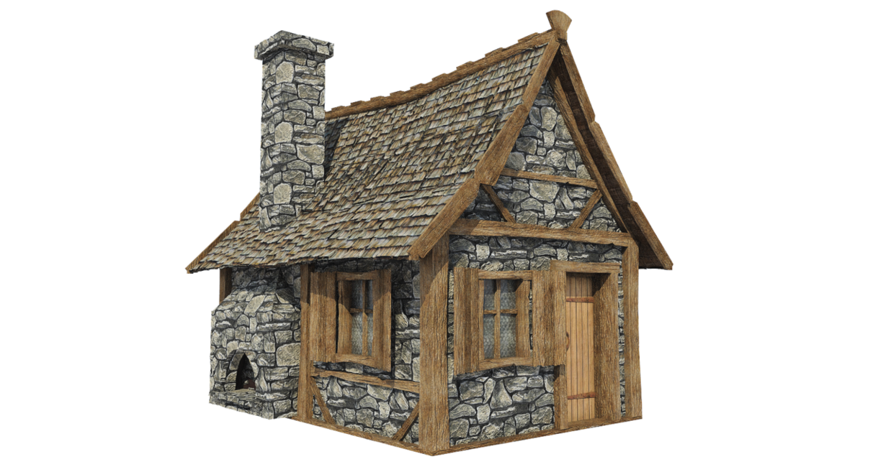
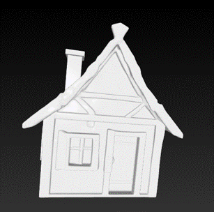
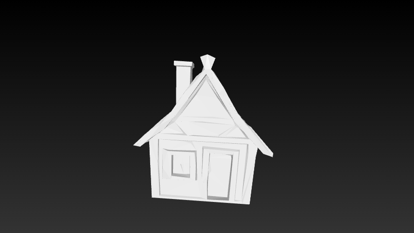

# GameDev AI 2025   
**Трек:** Генерация 3D моделей  

## Описание
Это пайплайн для генерации 3D-моделей из одиночного изображения с последующей упрощённой (low-poly) версией и наложением текстур. Используется модель от Tencent Hunyuan3D (FlowMatching + Paint) для реконструкции и текстурирования.  
  
## Демонстрация процесса  
Ниже показан пример преобразования входного изображения в 3D-модель:  
  
| Этап | Визуализация |  
|------|--------------|  
| **1. Исходное изображение** |  |  
| **2. High-poly 3D модель** |  |  
| **3. Low-poly 3D модель** |  |  
| **4. Текстурированная low-poly модель** |  |  
  
> 💡 *Гифки демонстрируют вращение моделей в 3D-пространстве. Рекомендуется открывать репозиторий на GitHub/GitLab для корректного отображения анимации.*  
  
---  
  
## Ключевые возможности  
- Инференс high-poly 3D модели из изображения.  
- Упрощение модели до заданного количества треугольников (Quadric Error Metrics).  
- Генерация текстур на low-poly модели (GLB).  
- Управление seed'ом, poly/low-poly экспортом и текстурированием.  
- Робастная обработка входных изображений (конвертация в RGBA, удаление фона).
  
## Инструкция  
1. Импортировать ноутбук img-to-3d.ipynb на платформу kaggle.  
2. Выбрать в accelerator доступное GPU (GPU T4 x2 или GPU P100).    
3. Запустить сессию и выполнить все блоки кода с установкой зависимостей и импортировать библиотеки (в ноутбуке всё озоглавлено и интуитивно понятно).  
4. Далее описание параметров функции image_to_3d:  
  - img_path (str): Путь к входному png изображению.  
  - save_dir (str): Каталог, куда сохраняются результаты (hi/low poly, текстурированная модель). По умолчанию: "/kaggle/working/output"    
  - name_model (str): Префикс имени выходных файлов. По умолчанию: "3d_model" 
  - triangles (int): Целевое число треугольников для упрощённой (low-poly) модели. По умолчанию: 1900
  - textures (bool): Генерировать ли текстурированную версию low-poly модели. По умолчанию: True    
  - hi_poly (bool): Экспортировать ли high-poly OBJ до упрощения. По умолчанию: False 
  - seed (int): Фиксирует случайность (для детерминизма инференса). По умолчанию: 777  
5. После объявления image_to_3d можете использовать её со своими параметрами. Удачи!  
(в среднем генерация 3д модели + текстур занимает чуть больше 5 минут, без текстур около 4 мин.)
